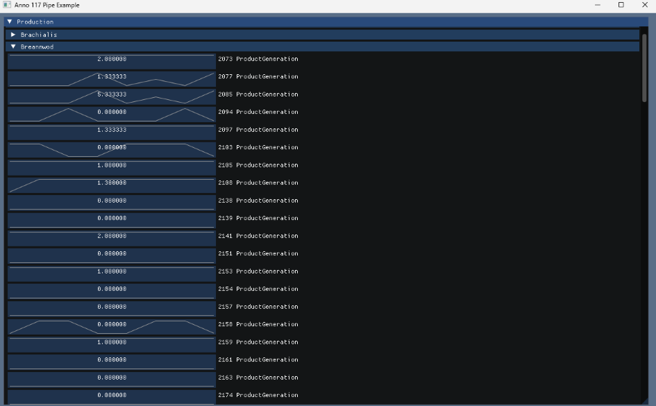
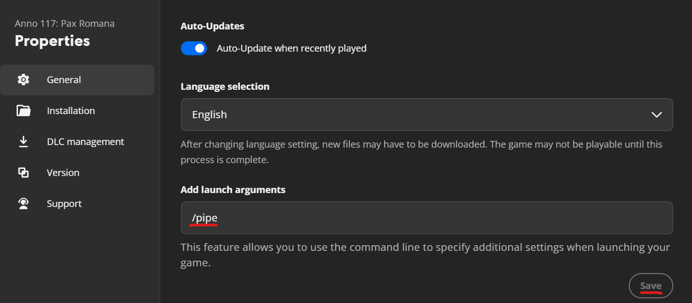

This example code demonstrates how to read statistics screen data from the **Anno 117** pipe.
It establishes a connection with the game via a Windows pipe, reads statistics data and displays it in raw format using ImGUI.



## Getting Started

1. **Enable the pipe in-game.** Add `/pipe` as a launch argument for Anno 117 — in Ubisoft Connect:
   right-click the game > Properties > "Add launch arguments" > type `/pipe` > Save.

   

2. **Check out this repo**, including its submodules — see [Checkout](#checkout) below. If you're new
   to git submodules, [GitHub Desktop](https://desktop.github.com/) is the easiest path.

3. **Build it** — see [Build](#build) below. This produces `anno117_pipe.exe`.

4. **Launch the game** (with `/pipe` enabled from step 1), then run `anno117_pipe.exe`. While it's
   running, open one of two pages at `http://127.0.0.1:53117/` in a browser:
   - **`http://127.0.0.1:53117/`** — the full [`anno-117-calculator`](https://github.com/anno-mods/anno-117-calculator)
     planning tool (embedded in this repo), for planning island layouts and production chains.
   - **`http://127.0.0.1:53117/statistics.html`** — a lightweight, read-only live view of your
     current production statistics per island, without the full calculator UI.

   See [Local statistics server](#local-statistics-server) below for details on what each page shows
   and how the live data reaches them.

## Experimental Feature
The pipe interface is provided as an easter egg and is primarily intended for curiosity, experimentation, and community-made tools.
It should not be considered an official or supported API, and compatibility across game versions is not guaranteed.
Likewise, the code in this repository is provided for documentation purposes only and should not be regarded as an officially supported SDK or reference implementation.

## Data
Data available follows the format outlined in `pipe.h`:
```C++
struct ProductionEntryData
{
	std::int32_t ProductGuid;

	float ProductGeneration;
	float ProductConsumption;
	float ProductDelta;
	float PerfectProductGeneration;
	float PerfectProductConsumption;
	std::int32_t AmountOfBuildings;
	std::int32_t TotalMaintenance;
	float TotalIncome;
	std::int32_t TotalProfit;
	float SummedProductivity;
	float AverageProductivity;
	
	std::unordered_map<std::int32_t, std::int32_t> WorkforceGUIDtoAmount;
	std::unordered_map<std::int32_t, std::int32_t> BuildingGUIDtoAmount;
};
```
See `pipe.cpp` for the communication protocol.

> **Identity gotcha:** `islandID`+`areaIndex` alone do **not** uniquely identify an island across a
> play session - `islandID` repeats across different game sessions/regions, and `areaIndex` is
> observed constant in every captured sample. Anything that keys state per-island (a cache, a UI
> list, ...) needs `sessionGUID` (or `sessionID`) in that key too. This was found the hard way as a
> real bug in the calculator companion's live view before it was fixed there.

## Activation
The pipe can be activated by adding the launch argument `/pipe` to the game.
Statistics data is sent periodically to the pipe.

## Local statistics server
Alongside the pipe reader and the ImGui window, the app runs a small embedded HTTP server
(loopback-only, `127.0.0.1:53117`) that mirrors each `AreaProductionStatistics` message as a
Server-Sent Events feed on `GET /statistics`.

This app embeds the [`anno-117-calculator`](https://github.com/anno-mods/anno-117-calculator)
companion as a git submodule (`external/anno-117-calculator` - see "Checkout" below) and serves it
same-origin at `/`, so opening `http://127.0.0.1:53117/` gets the full calculator app, and
`http://127.0.0.1:53117/statistics.html` gets its live-statistics page, both getting their live
data from this same process - no extra setup needed once the submodule is initialized.

Override the served directory with `--calculator-dir <path>` (e.g. to point at your own checkout
instead of the vendored submodule); if the directory doesn't exist, the server degrades to serving
only `/statistics` and logs that static files were skipped.

> **Known gap:** only the bundled files in the `dist/` folder are served to the browser.
> If you edit the source files of the calculator you need to run `npm run build`
> inside `external/anno-117-calculator` yourself (see "Updating the embedded calculator" below).

### Testing without the game running

`--replay-file <path>` points at a JSONL file (one `/statistics` payload per line) that's broadcast
once at startup, so a client connecting to `/statistics` right away is caught up from the replay
cache without the game or the pipe needing to be running. `docs/test-replay-data.jsonl` is a ready-made
fixture derived from `docs/example_responses.txt` (one line per unique `islandId`, in-game-currency
fields zeroed out):

```
anno117_pipe.exe --replay-file docs\test-replay-data.jsonl
```

## Checkout
This repo uses two git submodules (`external/vcpkg` and `external/anno-117-calculator`), so a plain
clone alone leaves both empty.

**New to git submodules?** The easiest path is [GitHub Desktop](https://desktop.github.com/):
1. "Add" > "Clone repository" and paste this repo's URL.
2. GitHub Desktop clones the repo but doesn't fetch submodule contents on its own - open
   "Repository" > "Open in Command Prompt" (or "Terminal") from its menu, then run the one-time
   command below in the window it opens.

Command-line git (any OS, or the terminal GitHub Desktop opened for you):
```
git clone --recurse-submodules <this repo's URL>
```
or, if you already have a plain clone:
```
git submodule update --init --recursive
```

## Build
The project uses CMake with vcpkg in manifest mode, targeting Visual Studio 2022.

1. Bootstrap the vendored vcpkg submodule (first time only - already initialized by "Checkout" above):
   ```
   external\vcpkg\bootstrap-vcpkg.bat
   ```
2. Configure and build:
   ```
   cmake --preset windows-vs2022
   cmake --build --preset windows-vs2022-release
   ```
   The resulting binary is written to `build/windows-vs2022/Release/anno117_pipe.exe`.

Alternatively, open the folder in Visual Studio 2022 (File > Open > Folder) and it will pick up
`CMakePresets.json` automatically - or use its Build menu instead of the `cmake --build` command
above.

### Updating the embedded calculator
`external/anno-117-calculator` is a git submodule pinned to a specific commit of
[`anno-117-calculator`](https://github.com/anno-mods/anno-117-calculator) - this repo doesn't build
or regenerate any of its files. To pick up a newer commit: update the submodule the normal git way
(`cd external/anno-117-calculator && git checkout <ref>`, then commit the updated gitlink here). To
change the game-data mappings (`js/params.js`) the calculator itself uses, that's generated by a
separate tool in the calculator's own toolchain (`asset-extractor`, see that repo's own docs) - not
something to do from this repo.

## Background
- `docs/example_responses.txt` - real captured `/statistics` payloads (protocol v2), useful as a
  reference for the actual shape/scale of the data beyond the struct definition above.
- `docs/ideation/` - an evaluation of transport/packaging options considered before landing on the
  embedded-submodule approach this repo uses today.
- `docs/plans/2026-09-20-001-feat-game-connector-plan.md` - the cross-repo requirements for
  connecting this pipe's live data into the calculator's own UI (not just the read-only statistics
  page), including exactly which of this app's fields the calculator side depends on.
